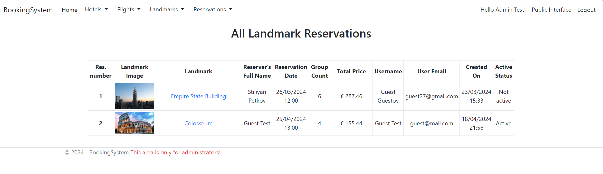

# Booking System ✈️

BookingSystem is an ASP.NET MVC application for managing bookings for flights, hotels, and landmarks. It allows users to make reservations for various accommodations and attractions, with a focus on user verification and flexible booking options. 

## Features 💡

- **👩‍💻 User and Admin Layers**: BookingSystem has two layers - user and admin - each with distinct functionalities and permissions.
- **✈️ Flight, Hotel, and Landmark Booking**: Users can make reservations for flights, hotels, and landmarks.
- **✅ Verification Process**: Reservations undergo a verification process before becoming active, allowing users to reserve accommodations without immediate payment.
- **🤩 Flexible Booking Options**: Users can choose when to verify their reservations, enabling them to secure bookings even if they're unable to make immediate payment.
- **🎫 Landmark Reservations**: Users can reserve tickets for landmarks, with free entry available for some attractions.
- **📋 Reservation Management**: Users can view, edit, and cancel their reservations and verifications.
- **🛡️ Admin Control Panel**: Admins have access to an admin panel where they can manage landmarks, hotels, flights, rooms, and reservations. They can also view details about all users and their activities.

## 🛠 Technologies Used

- ASP.NET MVC
- C#
- Entity Framework
- MS SQL
- JavaScript
- HTML
- CSS
- Bootstrap
- jQuery

## ⚙️ Installation

1. Clone the repository: `git clone https://github.com/yourusername/BookingSystem.git`
2. Navigate to the project directory: `cd BookingSystem`
3. Open the solution file in Visual Studio.
4. Build the solution.
5. Configure the database connection in `appsettings.json`.
6. Run the application.

## 👨‍💻 Usage

1. Register as a user or log in as an admin.
2. Explore the public interface to browse flights, hotels, and landmarks.
3. Make reservations and follow the verification process.
4. Manage reservations and verifications in the user dashboard.
5. Access the admin panel to manage system settings and view user activities.

## 🚀 Test the app

You can use the following credentials to test the application:
- Admin: admin@mail.com - admin123
- Guest: guest@mail.com - guest123

## 📸 Screenshots

## ✏️ Contributing

Contributions are welcome! Please follow these guidelines:
- Fork the repository.
- Create a new branch: `git checkout -b feature-name`.
- Make your changes and commit them: `git commit -m 'Add feature'`.
- Push to the branch: `git push origin feature-name`.
- Submit a pull request.

## 📄 License

This project is licensed under the [Apache License 2.0](LICENSE).

## 💎 I hope you like it!  
